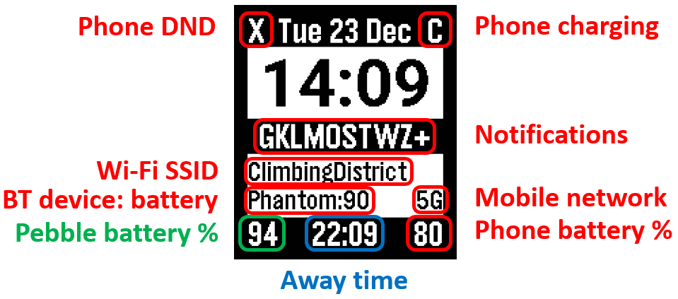

# Capeta[^1] companion (Android app)

This app, together with the related watchface and watchapp,
is intended to replace the combination of Tasker, Canvas, and PebbleTasker
that I personally used on the original Pebble (and Pebble Time).

Compared to the previous combination, this version has much fewer customizability
(no Takser! no Canvas!) but corresponds to the specific configuration I used[^2].

[^1]: The name comes from Canvas, Pebble and Tasker. It's formally a common word,
so it can be capitalized any way.

[^2]: I *may* be convinced to add functionality at a later date.

Limitations:

- Only supports square watches
- Requires Android 15 or above
- No color support (only Pebble 2 Duo)
- Only English
- Timezone adjustment is done "by hand"

# Features

## Time and Date

- Current date and time (hey, it's a timepiece)
- One other timezone

The "other" timezone must be configured by hand, relative to the local timezone.
The time difference is expressed in signed decimal, fractional hours.
For example, if you live in London (UTC+0:00) and want to show Bengaluru's time
(UTC+5:30), the difference is `+5.5` hours.
Saint-John's in Newfoundland, Canada (UTC-3:30), is at `-3.5` hours,
while Kathmandu, Nepal (UTC+5:45), is at `+5.75` hours.

## Power management

- Pebble battery level
- Phone battery level and plugged status

The "plugged" status means something is plugged that's capable of charging the phone.
Depending on the phone's charging policy, it may or may not be actually charging the battery,
at any speed, so the battery level may go down while plugged.

## Phone status

- Telephony mode (4G, 5G, no service)
- Connected Wifi SSID and Internet access indicator
- Connected Bluetooth device name and battery level (if available)

When Wifi is connected to an access point (SSID shown),
policy may prevent the phone from having access to the Internet.
In such a case, the SSID is prefixed with a `-` indicator[^3].

[^3]: The `-` indicator is yet to be implemented.

## Notifications

- Summary of active notifications

The watch shows a one-letter indicator for any active (not cleared) notification on the phone.
This is useful when you forget there was a notification.
You can assign a letter to each app you care about, so you know at a glance that 
there's a pending notification for that app.

There's no limit to the number of apps (Android packages) you can register for this feature.
Note that the watch face does have a limit of 15 simultaneous indicators,
which would probably overflow the width of the display anyway.
If there are more than 15 indicators to show, the app clips the list arbitrarily.

## Watch-app features[^4]

[^4]: Watch-app is under development.

- Phone's Do-not-disturb state and control
- Find my phone

Due to the recent changes in Android's DND functionality,
it's no longer possible to enable or disable a "Quiet mode".
Instead, the app registers a normal, time-based, "Zen rule"
that can be toggled from the watch-app.
The enabled state of that mode is shown on the watch.
This feature is independent of the watch's Quiet time.

*Find my phone* does everything it can to help you locate the phone:

- Ring a melody at maximum volume
- Activate the screen and the flashlight
- Vibrate at maximum strength

The obnoxious ringing can be disabled from the phone's notification screen
or from the watch.

Note: the watch-app can be invoked on the watch by assigning it to a Quick Launch button.

## Permissions

Several Android permissions are required.
For simplicity, the permissions are requested at the app's first startup,
in a batch, and the app refuses to continue until all the permissions are granted.

# App code critique

This is my first "useful" Android app written from scratch.
While the coding style is relatively clean and Kotlin-idiomatic,
some usages of the Android SDK seem a bit clunky.

## Permissions

## Composition and state

## UI and Graphics

## The `Pebble` object

## The `Notifications` object

## Other tricks and kludges

### `UiNotifications.getApplicationIcon()` function

# TODO

- Main UI
    - [x] Remove Quit button, replace with "?" button
    - [x] Remove help screenshot
    - [x] Hide Service notification from lock screen
    - [x] bug: Refresh main list after edit
    - [x] Sort main list by app name and channel name
    - [x] Request permissions one by one
    - [x] Honor "should display rationale"
    - [ ] Group permissions

- Notification UI

    - [x] Change text edit mode to litteral input
    - [x] Main list: add app name in list, sort by app name
    - [x] App list: same
    - [x] Prefetch app icon
    - [x] Use lazy list in List of all application
    - [x] Also use full screen
    - [x] Use channels
    - [x] Show full list if no active
    - [ ] Sort indicators somehow

- Other indicators 
    - [ ] BT: Remove "LE-"
  
- Service
    - [x] Refresh notification list when Service starts
    - [ ] Heartbeat in Service to feed isConnected
        - update each interaction
        - 30 second interval when connected
        - 5 second interval after disconnection
        - display "last contact" date/time
        - remove Reconnect button
    - [ ] Auto-start at boot
  
- Pebble object
    - [ ] Remove context field from Pebble
    - [ ] Pebble object caches Info

- Clean code
    - [ ] Rationalize and rename activeList, allList and indicators map
  
- Future: DND

- Future: Find Phone
 
- Future: Watch-app
  